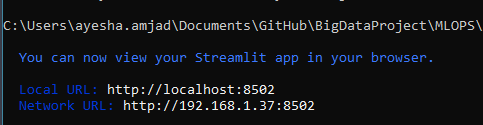
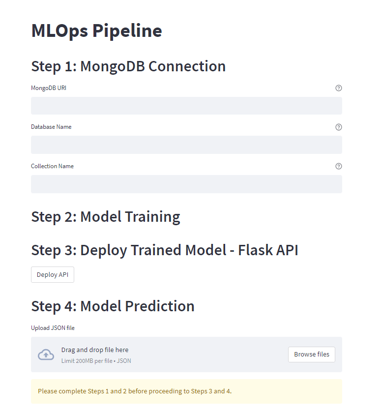
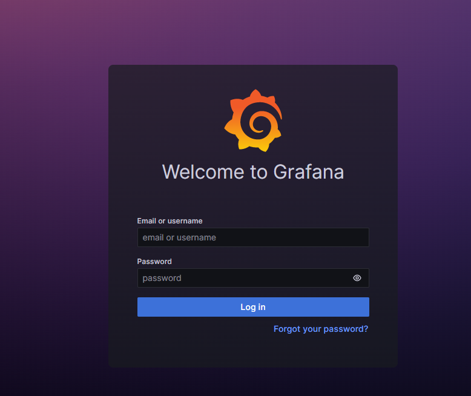
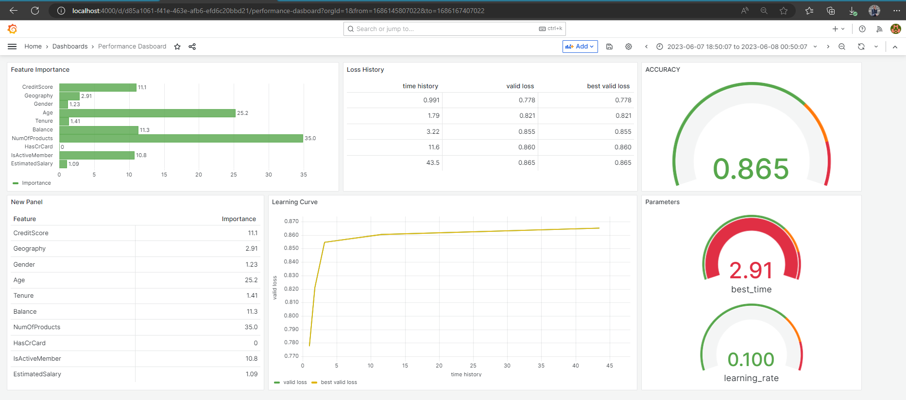

# MLOPS Web app- Big Data Analytics Project

## Docker Containers: MongoDB, Automl, Flask API, Grafana, Streamlit

### Overview 
dsfsdklksdl

The objective of this project is to develop an end-to-end MLOps pipeline that leverages docker containers for scalability and portability.
The pipeline will be hosted on a web server and connected to a webpage that allows anyone to use this MLOps pipeline as a service.

The pipeline encompasses data ingestion from MongoDB database, AutoML model training using FLAML library in python, a web server for deploying the best model to serve for predictions, and finally a python script for consuming the best model API and generating predictions. Each action is hosted in a docker container of its own.

### Technology Stack

| Docker                                                       | MongoDB                                                      | FLAML                                                        | FLASK  API                                                   | Grafana                                                      | Streamlit                                                    |
| ------------------------------------------------------------ | ------------------------------------------------------------ | ------------------------------------------------------------ | ------------------------------------------------------------ | ------------------------------------------------------------ | ------------------------------------------------------------ |
|  |  |  |  |  |  |

### Simple Workflow

This video shows how the pipeline is up and running with the web application. In the video the streamlit isn't set up in a container but in my own system (to avoid complexity and improve performance), however, the YAML file should take care of streamlit app running inside a container. 

[BDA-Project-11418-20230608_124522-Meeting Recording.mp4](https://asterasoftware-my.sharepoint.com/:v:/g/personal/ayesha_amjad_astera_com/ETHd4xx3r8tFtanV85ajlMsBxOxdzZr39Q-KlaeMR7ACng?e=EjVXdz)

### Setup Instructions

Clone this repository to utilize the MLOPs pipeline for your MondoDB data. 

Before running the docker-compose, we need to build the images in our docker. 

> Note: For each docker build command, open a new terminal window

1. You can either download the latest mongo image from the HUB by using:

```
docker pull mongo
```

or you can build a new image by opening cmd, navigate to the Project/mongodb directory and run the following command:

```
docker build -t mongodb .
```

2. Build an image for automl by navigating to Project/automl directory and running the following command:

```
docker build -t automl .
```

3. Build an image for webserver by navigating to Project/webserver directory and running the following command:

```
docker build -t webserver .
```

4. Build an image for webpage by navigating to Project/webpage directory and running the following command:

```
docker build -t webpage .
```

5. Navigate to directory containing docker-compose.yml file and run the following command in the terminal. This will run all 5 docker containers on your system. 

```
docker-compose up -d
```

6. To check if all containers are up and running, run following command in the terminal

```
docker ps
```


Once all your containers are up and running, Open a new terminal window 

7. Go inside streamlit bash by navigating to the webpage folder and running following command in the terminal

```
docker exec -it streamlit bash
```

8. Once you are inside bash shell, navigate to the '/app' directory where your app.py script is located

```
cd /app
```

9. Start the streamlit app by running following command 

```
streamlit run app.py
```

Streamlit will start the app, and you should see the output in the terminal, including a local URL to access the app in your browser. This is how it lokked for me:




10. This is how the web page is supposed to look like:



Enter the required configurations to train an ML model on your data. 


11. When you click on **Open Grafana Dashboard** button, you will be redirected to http://localhost:4000/login address. 
    This is where you can enter default credentials [username: admin, password: admin]

    

    

12. This should open up a grafana dashboard monitoring the performance of the ML model on your data, as shown below in the example:

    

